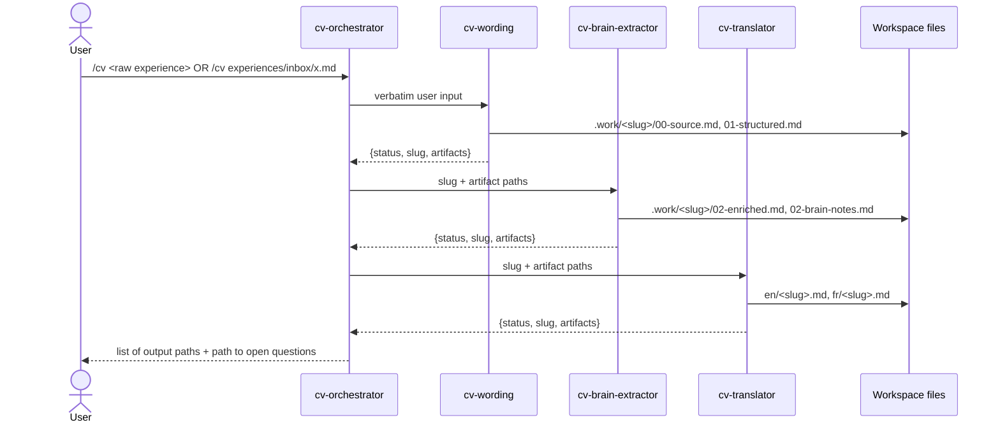

# Spec — Multi-Agent CV Experience Enhancer

Status: v1.1 (implemented; files under `.github/` are the source of truth)
Target runtime: VS Code Copilot custom agents (`.agent.md`), skills, hooks (Local harness, Windows / PowerShell)

Audience: Avanade consultant CV, read by staffing managers and client decision-makers from any industry. Not tailored to a job offer: the goal is to be assigned to new missions with new clients.

---

## 1. Goal

Turn a raw, verbose experience description into CV-ready content that:

1. Still states **what was done** (factual, verifiable).
2. Makes the **judgment behind it** explicit (problem framing, trade-offs, initiative, impact) so the reader sees it was not a task anyone could execute.
3. Takes **at most 80 % of the space** of a reference description (characters and wrapped lines), and is **pleasant to read**: a lead sentence stating the client's need, then 2–3 verb-led bullets, instead of the reference's compacted list of nominalizations.
4. Exists in **English and French**, each following that language's CV conventions, with the same underlying structure.

Non-goals: generating a full CV, layout/PDF, inventing achievements.

---

## 2. Design Decisions (deviations from the initial idea)

| # | Initial idea | Decision | Reason |
|---|---|---|---|
| D1 | Orchestrator passes content between agents | **File-based handoff.** Agents write artifacts to a staging folder; the orchestrator only forwards **paths** | Orchestrator never reads or rewrites content — strongest practical form of "doesn't read the prompt" |
| D2 | Raw experience given only as chat prompt | Support **two input modes**: inline prompt (forwarded verbatim) or file in `experiences/inbox/` (only the path is forwarded) | Inbox mode means the orchestrator never sees the content at all; also enables batch processing |
| D3 | Short intro + reference description embedded in agent prompts | Stored as **files** in `docs/cv-context/` | Single edit point; the length-check script needs the reference as a file anyway |
| D4 | 80 % length rule enforced by the wording agent | Enforced **deterministically by a hook script** on every description artifact (structured, enriched, EN, FR) | LLMs count characters badly; the brain extractor would otherwise inflate the text back past the budget |
| D5 | Brain extractor appends value | Brain extractor **rewrites/merges** value into the description (not append) and writes a separate notes file | Keeps the output within budget; notes carry traceability and open questions |
| D6 | CV writing conventions inside each agent | Extracted to a **skill** `cv-style-guide` (EN + FR references, verb lists, banned filler) | Shared by wording + translator; reusable by future agents |
| D7 | Brain extractor may "add value" freely | **Anti-fabrication rule** + traceability table + open-questions file | Invented metrics are the main failure mode of CV-enhancing LLMs; the questions are where the real extra value comes from |
| D8 | Hooks only on PreToolUse | PreToolUse (**sandbox**, allowlist per role) + PostToolUse (**length check**) | Sandbox and quality gate are both deterministic |
| D9 | Invoke orchestrator from agent picker | Add a prompt file `/cv` as entry point | One-command usage |
| D10 | Input = raw description only | Input = **CV entry** (title, role, solutions, description; may hold several projects) + optional **summary** in the user's words. Template: `experiences/inbox/_template.md`. Multi-project entries keep one block per project in the description | The summary carries the reasoning and facts the CV entry omits |
| D11 | Solutions copied as given | Wording and brain extractor **add** technologies explicitly named in description/summary, normalize spelling, never remove, never add implied ones (asked instead). Changes logged in brain notes | Solutions list is often incomplete compared with the real experience |

The translator stays an agent (not a skill): it needs its own write scope (`experiences/en`, `experiences/fr`) and context isolation.

---

## 3. File Layout

```
.github/
  agents/
    cv-orchestrator.agent.md
    cv-wording.agent.md
    cv-brain-extractor.agent.md
    cv-translator.agent.md
  skills/
    cv-style-guide/
      SKILL.md
      references/
        en.md              # EN conventions, action verbs, examples
        fr.md              # FR conventions, nominal style, typography
        banned-phrases.md  # filler / buzzwords to never output (EN + FR)
        value-signals.md   # taxonomy used by the brain extractor (§6.3)
  hooks/
    scripts/
      cv-common.ps1        # shared: input parsing, path resolution, description metrics
      guard.ps1            # PreToolUse sandbox, role-aware
      check-length.ps1     # PostToolUse length gate
  prompts/
    cv.prompt.md           # /cv entry point -> cv-orchestrator
docs/
  cv-context/
    profile.md             # user's short introduction (pre-prompt context)
    reference-too-long.md  # example description that is too long (length baseline)
  cv-agents-spec.md        # this file
experiences/
  inbox/                   # optional raw inputs (input mode B)
  .work/<slug>/            # staging artifacts per run (gitignored)
  en/<slug>.md             # final English version
  fr/<slug>.md             # final French version (same filename)
```

> Note: the current `.gitignore` ignores `.github`, so agents, skills and hooks will not be versioned. Remove that line if they should be committed. Add `experiences/.work/` to `.gitignore`.

---

## 4. Pipeline



Strict order: wording → brain extractor → translator. No parallelism, no skipping.

### 4.1 Handoff contract

Every subagent's **final message** is exactly one JSON object, nothing else:

```json
{
  "status": "ok | error",
  "slug": "ci-pipeline-migration",
  "artifacts": ["experiences/.work/ci-pipeline-migration/01-structured.md"],
  "message": "short reason when status=error, else empty"
}
```

Orchestrator rules:
- Builds the next delegation from `slug` + `artifacts` only.
- On `status: error` → stops the pipeline and reports `message` to the user verbatim. No retries.
- Final report to the user: the two output paths and the path of `02-brain-notes.md` (open questions). It does not open or summarize any file.

### 4.2 Staging artifacts (`experiences/.work/<slug>/`)

| File | Writer | Content | Length-checked |
|---|---|---|---|
| `00-source.md` | wording | Raw input copied verbatim (traceability, reruns) | No |
| `01-structured.md` | wording | Structured, concise description in source language | Yes |
| `02-enriched.md` | brain extractor | Same description with judgment/value merged in | Yes |
| `02-brain-notes.md` | brain extractor | Signals found, traceability table, inferences, open questions | No |

Stages 1–2 work in the **source language** of the input. Only the translator produces EN/FR.

---

## 5. Context Files (user-maintained)

### 5.1 `docs/cv-context/profile.md`
Short self-introduction: background, domains, recurring strengths, target roles. Read by the brain extractor (mandatory) and translator (for tone). Missing file → brain extractor returns `error`.

### 5.2 `docs/cv-context/reference-too-long.md`
The CNAV "Intégration de fonctionnalités sur les différents sites" experience. It is both the length baseline and the example of the style to avoid (dense list of nominalizations, no visible reasoning). Only its `## Description` section is measured:

$$\text{budget} = \lfloor 0.8 \times \text{chars} \rfloor \text{ chars} \;\wedge\; \lfloor 0.8 \times \text{lines} \rfloor \text{ lines}$$

- Chars: after stripping frontmatter, HTML comments, Markdown emphasis/links, collapsing whitespace.
- Lines: each paragraph/bullet wrapped at 70 chars (approx. CV column width), rounded up. This models *space taken*: a short bullet still costs a full line.
- Current values: reference = 627 chars / 11 lines → budget = **501 chars / 8 lines**. Same budget for EN and FR (the reference is French).
- Tunables at the top of `check-length.ps1`: `$Ratio`, `$LineWidth`.

Missing file → wording agent returns `error`; the length hook blocks with an explicit reason.

---

## 6. Agents

All subagents: `user-invocable: false`. Only the orchestrator is user-facing.

### 6.1 `cv-orchestrator`

```yaml
---
description: "CV experience pipeline orchestrator. Use when: improving a CV experience, rewriting an experience for a CV, /cv."
tools: [agent]
agents: [cv-wording, cv-brain-extractor, cv-translator]
user-invocable: true
hooks:
  PreToolUse:
    - type: command
      windows: "powershell -NoProfile -ExecutionPolicy Bypass -File .github/hooks/scripts/guard.ps1 -Role orchestrator"
      timeout: 10
---
```

Behavior:
- DO NOT read, summarize, interpret, correct, or comment on the user's input.
- First action is always delegating to `cv-wording` with the user input **verbatim** (inline text or inbox path, unchanged).
- Then `cv-brain-extractor`, then `cv-translator`, passing only `slug` + `artifacts`.
- Allowed tool: `runSubagent` only (enforced by hook).
- Output to the user: output paths + open-questions path, or the error message.

### 6.2 `cv-wording`

```yaml
---
description: "Restructures a raw CV experience description into a concise structured draft within a length budget."
tools: [read, edit]
user-invocable: false
reasoning-effort: medium
hooks:
  PreToolUse:  [{ type: command, windows: "powershell -NoProfile -ExecutionPolicy Bypass -File .github/hooks/scripts/guard.ps1 -Role wording", timeout: 10 }]
  PostToolUse: [{ type: command, windows: "powershell -NoProfile -ExecutionPolicy Bypass -File .github/hooks/scripts/check-length.ps1", timeout: 10 }]
---
```

Inputs: raw text or inbox path; `docs/cv-context/reference-too-long.md`; skill `cv-style-guide`.

Steps:
1. If input is a path under `experiences/inbox/`, read it; otherwise use the text as given.
2. Generate `slug`: English, kebab-case, ≤ 5 words, ≤ 40 chars, describes the experience (e.g. `ci-pipeline-migration`). If `experiences/en/<slug>.md` exists, append `-2`, `-3`, …
3. Write `00-source.md` (verbatim input).
4. Write `01-structured.md`:
   - Frontmatter: `slug`, `source_lang` (`en|fr`), `current` (bool, if detectable: role still ongoing), `skills` (list extracted from input, no additions).
   - `# <Short title>`
   - `Context:` one line (org type, team, scope — only what the input states).
   - 2–5 bullets: one task/achievement each, action-first, no filler.
5. Must not add facts, metrics, or skills absent from the input. Must not add "value" statements — that is stage 2.
6. Respect length budget (hook enforces; on block, shorten and rewrite; after 2 failed attempts return `error`).

Anti-patterns to avoid (from reference file): chronological narration, repeated context, tool lists inside sentences, passive voice, "I was in charge of…".

### 6.3 `cv-brain-extractor`

```yaml
---
description: "Extracts and surfaces the judgment, reasoning and impact behind a CV experience, merging it into the description without inventing facts."
tools: [read, edit]
user-invocable: false
reasoning-effort: high
hooks:
  PreToolUse:  [{ type: command, windows: "powershell -NoProfile -ExecutionPolicy Bypass -File .github/hooks/scripts/guard.ps1 -Role brain", timeout: 10 }]
  PostToolUse: [{ type: command, windows: "powershell -NoProfile -ExecutionPolicy Bypass -File .github/hooks/scripts/check-length.ps1", timeout: 10 }]
---
```

Inputs: `00-source.md`, `01-structured.md`, `docs/cv-context/profile.md`, skill reference `value-signals.md`.

Value-signal taxonomy (`value-signals.md`):

| Signal | What it shows | Example transformation |
|---|---|---|
| Problem framing | Found the real problem / root cause, not the symptom | "Fixed slow builds" → "Traced slow builds to redundant dependency resolution and…" |
| Decision & trade-off | Chose X over Y for a reason | "…chose incremental migration over a rewrite to keep releases unblocked" |
| Constraint handling | Delivered under limits (time, legacy, budget, regulation) | "…without downtime on a legacy stack" |
| Initiative | Not assigned; proposed and drove it | "Proposed and built…" |
| Systemization | Turned a one-off into a reusable asset | "…packaged as a template reused by 3 teams" |
| Transfer | Applied knowledge from another domain (uses `profile.md`) | "…applying test-automation practices from QA to data pipelines" |
| Influence | Aligned, convinced, trained others | "…and onboarded the team through…" |
| Impact | Measurable or clearly qualitative outcome | "…cutting release time from days to hours" |

Steps:
1. Identify candidate signals in the source/structured text and `profile.md`.
2. Keep the **2–3 strongest** per experience (not all — dilution kills distinctiveness).
3. Rewrite each bullet as **Action + How/Why (judgment) + Result**, merging the signal into the bullet. Do not add separate "value" bullets.
4. Write `02-enriched.md` (same frontmatter + structure as `01-structured.md`), within budget.
5. Write `02-brain-notes.md`:
   - **Signals used**: signal → bullet number.
   - **Traceability**: each enriched claim → source sentence (quote) or `profile.md` line.
   - **Inferences**: claims that are reasonable readings but not explicit in the source, marked `to confirm`.
   - **Open questions**: targeted questions whose answers would strengthen the text (e.g. "How long did deployments take before/after?", "Was this your initiative or assigned?"), each tied to a bullet.

Hard rules:
- NEVER invent numbers, team sizes, tools, outcomes, or employers.
- No placeholders (`[X%]`, `TBD`) in `02-enriched.md`; missing quantification goes to open questions.
- Banned phrases (`banned-phrases.md`) are forbidden: e.g. "passionate", "results-driven", "leveraged synergies", "dynamic", "force de proposition", "rigoureux et motivé".
- Inferences may appear in the enriched text only if low-risk and listed under **Inferences**.

### 6.4 `cv-translator`

```yaml
---
description: "Produces English and French CV versions of an enriched experience, adapted to each language's CV conventions."
tools: [read, edit]
user-invocable: false
reasoning-effort: medium
hooks:
  PreToolUse:  [{ type: command, windows: "powershell -NoProfile -ExecutionPolicy Bypass -File .github/hooks/scripts/guard.ps1 -Role translator", timeout: 10 }]
  PostToolUse: [{ type: command, windows: "powershell -NoProfile -ExecutionPolicy Bypass -File .github/hooks/scripts/check-length.ps1", timeout: 10 }]
---
```

Inputs: `02-enriched.md`, `docs/cv-context/profile.md` (tone only), skill `cv-style-guide` (`en.md`, `fr.md`).

This is **adaptation, not literal translation**. Both files are produced even if one matches the source language (the source-language version is still normalized to its conventions).

Invariants across EN and FR:
- Same number of bullets, same order, same signal in each bullet.
- Same facts; nothing added or dropped.
- Same `slug` / filename.

| Aspect | EN (`en.md`) | FR (`fr.md`) |
|---|---|---|
| Lead sentence | Pronoun-less, client + need + contribution | Natural sentence, "j'ai" allowed once |
| Bullet form | Strong past-tense verb first, no pronoun ("Built…", "Automated…") | Past participle first, no subject ("Conçu…", "Repensé…"). Nominalizations ("Définition de…") are banned: they are what makes the reference dense |
| Tense | Past for ended roles, present for `current: true` | Lead sentence in present for `current: true`; bullets unchanged |
| Result phrasing | "…, cutting X by Y" / "…, enabling Z" | "…, permettant de…" / "…, réduisant…" |
| Tech terms | As-is | Keep established English terms (CI/CD, pipeline, cloud); no forced translation |
| Typography | Standard | Narrow no-break space before `:` `;` `?` `!`; « » quotes |
| Register | Direct, impact-first | Slightly more formal; avoid anglicisms that have a common French equivalent |

Output file format (`experiences/en/<slug>.md`, `experiences/fr/<slug>.md`):

```markdown
---
slug: sharepoint-intranet-features
lang: en
source_lang: fr
current: false
counterpart: ../fr/sharepoint-intranet-features.md
---
# <Short localized title>

**Role:** Modern Workplace Developer
**Solutions:** SharePoint, Power Apps, Power Automate, PnP PowerShell

## Description

<Lead sentence: client + need + contribution>
- <Action + how/why + outcome>
- <Action + how/why + outcome>
```

The H1 title is localized; the filename is not.

---

## 7. Hooks

Agent-scoped (inline frontmatter), so they do not affect normal Copilot use in this workspace.

### 7.1 `guard.ps1` — PreToolUse sandbox

Input: JSON on stdin (`tool_name`, `tool_input`, …). Parameter: `-Role orchestrator|wording|brain|translator`.

Rules, evaluated in order; first match wins:

1. **Workspace root** = resolved from `$PSScriptRoot` (`.github/hooks/scripts` → up 3 levels). Never taken from hook input.
2. **Tool allowlist per role** (deny anything else, including MCP, terminal, web, search, and unknown tools):

   | Role | Allowed tools |
   |---|---|
   | orchestrator | `runSubagent` |
   | wording | `read_file`, `list_dir`, `create_file`, `create_directory`, `replace_string_in_file` |
   | brain | `read_file`, `create_file`, `replace_string_in_file`, `multi_replace_string_in_file` |
   | translator | `read_file`, `create_file`, `create_directory`, `replace_string_in_file`, `multi_replace_string_in_file` |

   `runSubagent` is further restricted to `agentName` ∈ {cv-wording, cv-brain-extractor, cv-translator}. Known name variants (`copilot_readFile`, …) are mapped to the same kinds. If a tool is renamed in a future VS Code version it is denied (fail closed); check the agent debug logs and add the new name to `$ToolKinds`.
3. **Path extraction**: collect every path-like field in `tool_input` (`filePath`, `path`, `uri`, `dirPath`, arrays thereof). Tool with a file tool name but no extractable path → deny.
4. **Path normalization**: strip `file://`, URL-decode, `[IO.Path]::GetFullPath()`, case-insensitive compare. Reject if not under workspace root (blocks `..`, absolute paths, other drives, UNC paths).
5. **Always denied** (all roles): `.git/**`, `.github/agents/**`, `.github/hooks/**`, `.github/prompts/**` for write; `.git/**` for read. Agents cannot modify their own rules or hooks.
6. **Role scopes**:

   | Role | Read | Write |
   |---|---|---|
   | wording | `docs/cv-context/**`, `experiences/inbox/**`, `experiences/en/` (list only), `.github/skills/cv-style-guide/**` | `experiences/.work/**` |
   | brain | `docs/cv-context/**`, `experiences/.work/**`, `.github/skills/cv-style-guide/**` | `experiences/.work/**` |
   | translator | `docs/cv-context/**`, `experiences/.work/**`, `.github/skills/cv-style-guide/**` | `experiences/en/**`, `experiences/fr/**` |

7. Deny output (exit 0):

   ```json
   {
     "hookSpecificOutput": {
       "hookEventName": "PreToolUse",
       "permissionDecision": "deny",
       "permissionDecisionReason": "cv-guard: <role> may not <read|write> <relative path>"
     }
   }
   ```

   Allow → `permissionDecision: "allow"`. Malformed stdin → deny (fail closed).

### 7.2 `check-length.ps1` — PostToolUse length gate

- Triggers only when the edited path matches `experiences/.work/*/01-structured.md`, `experiences/.work/*/02-enriched.md`, `experiences/en/*.md`, `experiences/fr/*.md`. Otherwise exit 0 silently.
- Measures the `## Description` section per §5.2 (chars and lines).
- Over budget → `{"decision": "block", "reason": "Description over budget (max 501 chars and 8 lines of 70 chars). <file>: 627 chars / 11 lines. Shorten it…"}`.
- Reference missing, or internal error → exit 2 (blocking; non-0/2 exit codes would be fail-open).

### 7.3 Hook runtime notes

- Agent-scoped hooks run for that custom agent in the **Local** harness, including when it runs as a subagent (VS Code docs). They do not apply to Copilot CLI / Claude / Codex session targets: run `/cv` with the Local target.
- Requires `chat.useHooks` (default on) and a trusted workspace.
- Validated with 28 simulated tool calls (allow/deny per role, traversal, UNC, URI schemes, ADS, terminal/web/search tools, malformed JSON, length gate).

---

## 8. Skill: `cv-style-guide`

```yaml
---
name: cv-style-guide
description: "CV writing conventions for English and French experience bullets: action verbs, nominal style, typography, banned filler, value-signal taxonomy. Use when: writing, restructuring or translating CV experiences."
---
```

Body: short index pointing to `references/en.md`, `references/fr.md`, `references/banned-phrases.md`, `references/value-signals.md`. Each reference contains rules + 2–3 before/after examples. Examples should come from the user's own domain once available.

---

## 9. Entry Point: `/cv`

`.github/prompts/cv.prompt.md`:

```yaml
---
description: "Improve a CV experience (EN + FR)"
agent: cv-orchestrator
argument-hint: "Paste the raw experience, or a path under experiences/inbox/"
---
```

Body: `${input}` only — no extra instructions, so the orchestrator receives the input untouched.

---

## 10. Acceptance Tests

| # | Scenario | Expected |
|---|---|---|
| T1 | Normal inline input | `experiences/en/<slug>.md` + `experiences/fr/<slug>.md` created; same bullet count; both within budget |
| T2 | Inbox input | Same as T1; orchestrator transcript contains only the path, not the content |
| T3 | Orchestrator tries `read_file` | Denied by guard |
| T4 | Any agent reads `C:\Users\...\Documents\other.txt` or `..\..\x` | Denied |
| T5 | Translator writes to `experiences/.work/` or `.github/agents/` | Denied |
| T6 | Wording output > budget | PostToolUse block → agent shortens; after 2 failures → `status: error`, pipeline stops |
| T7 | Input with no numbers | Enriched text contains no invented metrics; open questions list quantification gaps |
| T8 | Slug collision | `-2` suffix, existing files untouched |
| T9 | `profile.md` missing | Brain extractor `error`; no EN/FR files written |
| T10 | Traceability | Every claim in `02-enriched.md` maps to a quote or profile line in `02-brain-notes.md` |
| T11 | Banned phrases | None present in EN/FR outputs (grep against `banned-phrases.md`) |

---

## 11. Phase 2 (optional upgrades)

| Upgrade | Value |
|---|---|
| **Recruiter critic agent** — scores specificity, evidence, distinctiveness ("could anyone else write this bullet?"); one revision loop via brain extractor | Objective quality gate |
| **Profile pitch agent** — builds the Avanade CV summary ("À propos" / "About") from all files in `experiences/en|fr`, highlighting recurring signals across missions | The summary is what staffing managers read first |
| **Answer loop** — user answers open questions in `02-brain-notes.md`, reruns `/cv <slug> --refine` starting at brain extractor | Converts inferences into confirmed, quantified claims |
| **Batch mode** — process every file in `experiences/inbox/` sequentially | Bulk migration of an existing CV |
| **Skills index** — script generates `experiences/skills-index.md` (skill → experiences) from frontmatter | Fast CV assembly per target role |

---

## 12. Open Decisions

| # | Question | Default if unanswered |
|---|---|---|
| Q1 | FR bullet style | Resolved: verbal ("Conçu…"); nominal is what made the reference dense |
| Q2 | FR length tolerance | Resolved: none, the reference is French |
| Q3 | Length unit | Resolved: characters AND wrapped lines (space taken) |
| Q4 | Version `.github/` in git? | Open: currently ignored |
| Q5 | Pin models per agent? | No pin |
| Q6 | `$LineWidth = 70` matches the Avanade template column? | Open: adjust after comparing with a real export |
